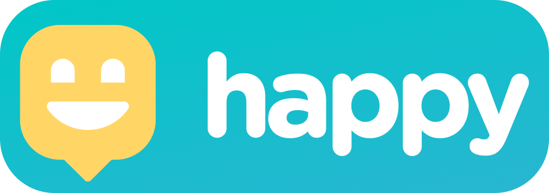
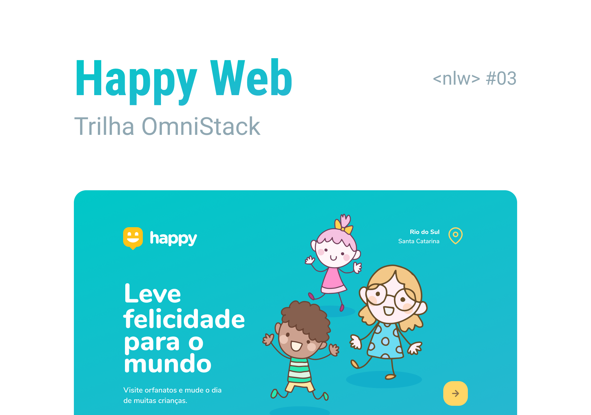

<h4 align="center">
    
    <br/>
    Leve felicidade para o mundo
    <br/>
</h4>

<p align="center">
  Next Level Week 3.0 🚀
  <br/>
  <br/>

  

  <a href="https://rocketseat.com.br">
    
  </a>

  <a href="https://github.com/MarlonRicci/happy/commits/master">
    
  </a>

  
</p>

## :mag: Sobre o projeto

Ajudamos a encontrar orfanatos para que você nos ajude a levar a felicidade a estas crianças :basketball:  
Desenvolvido durante a 3° versão da Next Level Week, oferecida pela [Rocketseat :rocket:][url-rocketseat] :coffee:  
O NLW detêm muito conteúdo prático, desafios e hacks onde o conteúdo fica disponível durante uma semana.
A criação do projeto veio com a homenagem para as crianças, já que a data de inicio coincide com o **dia das crianças** :boy::baby:

## :art: O protótipo?

O layout da aplicação em sua versão **web** está disponível no [Figma][url-figma]  


## :package: Como clonar a aplicação?

```bash
# Clonar o repositório
$ git clone https://github.com/MarlonRicci/happy
```

## :coffee: Como posso ajudar?

1. Faça o Fork deste repositório
2. Comece uma branch com sua feature

```bash
$ git checkout -b minha-feature
```

3. Confirme (Commit) seus feitos

```bash
$ git commit -m 'Minha nova feature'
```

4. Suba (push) sua branch

```bash
$ git push origin minha-feature
```

## :mortar_board: Quem ministrou ?

As aulas foram ministradas pelo [Mayk Brito][mayk], nas aulas do **Next Level Week 3.0 - Starter** :rocket:

## :page_with_curl: Licença

O projeto está utilizando a licença MIT. Confira [LICENSE][license] para mais detalhes.

---

<h4 align="center">
Feito com 💜 por <a href="https://www.linkedin.com/in/marlon-ricci/" target="_blank">Marlon Ricci</a>
</h4>
 
[url-figma]: https://www.figma.com/file/muxL0mtvXnHmN7SJ3jhFnC/Happy-Web?node-id=0%3A1
[url-node]: https://nodejs.org/pt-br/
[url-rocketseat]: https://rocketseat.com.br/
[url-git]: https://git-scm.com/
[url-vs]: https://code.visualstudio.com/
[url-npm]: https://www.npmjs.com/
[url-yarn]: https://yarnpkg.com/
[mayk]: https://github.com/maykbrito
[license]: https://github.com/MarlonRicci/happy/blob/master/LICENSE.md
